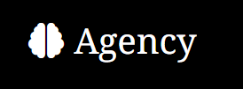
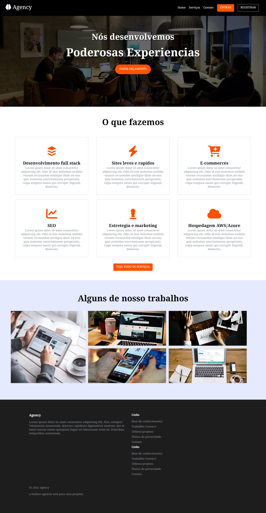
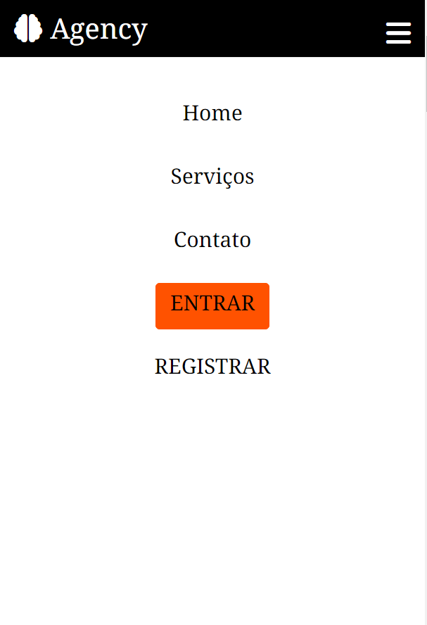

<h1 align="center">
  
</h1>

<h1 align="center">
  
</h1>

## 📱 Mobile 
<h1 align="center">
  
</h1>

## 🚀 Tecnologias

Esse projeto foi desenvolvido com as seguintes tecnologias:

- HTML
- SASS
- JavaScript

## 💻 Projeto

 Project Agency uma aplicação desenvolvida no curso de SASS, afim de estudar SASS/SCSS                                                         
                                                                   

## 🔖 Layout
Você pode visualizar o projeto  através [desse link](https://projeto-agency.vercel.app/).
